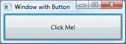

# WPF 개요

Windows Presentation Foundation, 마이크로소프트가 개발한 응용 프로그램 개발 프레임 워크

이것을 사용하면 시각적으로 뛰어난 사용자 환경을 통해 Windows용 데스크톱 클라이언트 애플리케이션을 만들 수 있다.

WPF의 핵심은 최신 그래픽 하드웨어를 활용하도록 작성된 해상도 독립적인 벡터 기반 렌더링 엔진입니다. WPF는 **XAML**(Extensible Application Markup Language), **컨트롤**, **데이터 바인딩**, 레이아웃, 2D 및 3D 그래픽, 애니메이션, 스타일, 템플릿, 문서, 미디어, 텍스트 및 입력 체계를 포함하는 포괄적인 애플리케이션 개발 기능을 사용하여 핵심을 확장합니다. WPF는 .NET의 일부이므로, .NET API의 다른 요소를 통합하는 애플리케이션을 빌드할 수 있습니다.


# 태그

XAML은 선언적으로 애플리케이션의 모양을 구현하는 XML 기반 태그 언어입니다. 

다음 예제에서는 XAML을 사용하여 단일 단추가 포함된 창의 모양을 구현합니다.

```xaml
<Window
    xmlns="http://schemas.microsoft.com/winfx/2006/xaml/presentation"
    Title="Window with Button"
    Width="250" Height="100">

  <!-- Add button to window -->
  <Button Name="button">Click Me!</Button>

</Window>
```


다음 그림은 위의 예제에서 XAML로 정의된 UI(사용자 인터페이스)를 보여줍니다.

 
